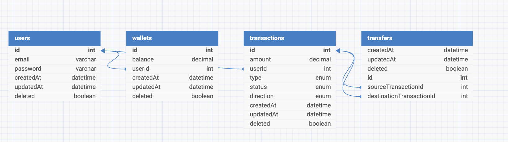

# Demo Credit

## Overview

This project is a comprehensive Node.js application named Demo Credit. It follows best practices in software engineering, including a well-structured MVC architecture, the use of object-oriented programming principles, and adherence to RESTful API design. The project handles user management, wallet operations, and transaction processing.

## Features

- User registration and authentication
- Wallet management (funding, withdrawing, and transferring funds)
- Transaction logging and management
- Comprehensive error handling and validation
- Modular and scalable architecture

## Project Structure

```
src/
|-- controllers/
|   |-- auth.controller.ts
|   |-- wallet.controller.ts
|
|-- services/
|   |-- auth.service.ts
|   |-- wallet.service.ts
|
|-- models/
|   |-- users.model.ts
|   |-- wallets.model.ts
|   |-- transactions.model.ts
|   |-- transfers.model.ts
|
|-- routes/
|   |-- auth.route.ts
|   |-- wallet.route.ts
|
|-- middlewares/
|   |-- auth.middleware.ts
|   |-- error.middleware.ts
|   |-- validation.middleware.ts
|
|-- dtos/
|   |-- users.dto.ts
|   |-- wallets.dto.ts
|
|-- interfaces/
|   |-- auth.interface.ts
|   |-- routes.interface.ts
|   |-- wallet.interface.ts
|
|-- exceptions/
|   |-- HttpException.ts
|
|-- utils/
|   |-- logger.ts
|
|-- config/
|   |-- index.ts
|
|-- databases/
|   |-- migrations/
|   |-- seeds/
|   |-- index.ts
|
|-- server.ts
|-- app.ts
```

## Installation

### **Requirements**:
- **Node.js**: v14+
- **MySQL**: For the relational database
- **npm**: Package manager

1. **Clone the repository**:
    ```bash
    git clone https://github.com/your-repository/demo-credit.git
    cd demo-credit
    ```

2. **Install dependencies**:
    ```bash
    npm install
    ```

3. **Set up environment variables**:
   Create a `.env` file in the root directory and add the following environment variables:
    ```bash
        NODE_ENV = 
        PORT =  
        DB_HOST = 
        DB_PORT = 
        DB_USER = 
        DB_PASSWORD =  
        DB_NAME = 
        SECRET_KEY = 
        LOG_FORMAT = 
        LOG_DIR =
        ADJUTOR_SECRET_KEY =
        ADJUTOR_APP_ID =
    ```

4. **Run database migrations**:
    ```bash
    npm run migrate
    ```

5. **Seed the database**:
    ```bash
    npm run seed
    ```

6. **Start the application**:
    ```bash
    npm run dev
    ```

## API Endpoints

### Authentication

- **POST /auth/register**: Register a new user
- **POST /auth/login**: Login with email and password

### Wallet

- **POST /wallet/fund**: Fund a wallet
- **POST /wallet/withdraw**: Withdraw funds from a wallet
- **POST /wallet/transfer**: Transfer funds to another user
- **GET /wallet/transactions**: Transfer funds to another user
- **GET /wallet**: Fetch wallet details


## **Database Design**

### Entity-Relationship Diagram


The database is structured to ensure **data normalization** and proper relationships between key entities. The schema includes the following tables:


## Testing

Run the tests using the following command:
```bash
npm test
```

## License

This project is licensed under the MIT License.

Project Review Document: https://docs.google.com/document/d/15K4gcOuWXpUoBedPWXNaSs2acmSgM88qIpyVsMGv3mE/edit?usp=sharing
